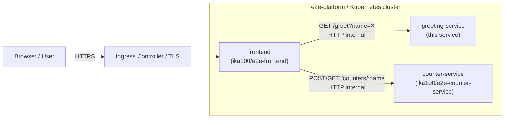
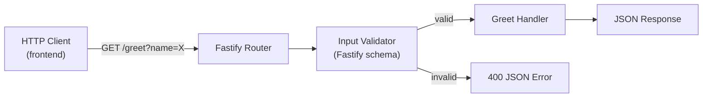

# greeting-service — Architecture

> **Project type:** microservice  
> **Spec:** [openspec/specs/greeting/spec.md](../openspec/specs/greeting/spec.md)  
> **RFC:** [docs/rfcs/RFC-0001-tech-stack.md](rfcs/RFC-0001-tech-stack.md)

---

## Context & Goals

The greeting-service is a stateless HTTP microservice inside the `e2e-platform`. Its sole
responsibility is to accept a `name` query parameter and return a personalised greeting.
It must be:

- **Lightweight and fast** — single endpoint, no I/O, sub-50 ms p95.
- **Secure** — validated input, non-root container, no HIGH/CRITICAL CVEs.
- **Deployable** — containerised, Kubernetes-ready, managed via ArgoCD GitOps.
- **Observable** — health probe, structured JSON logging.

---

## High-Level Architecture



**greeting-service internal flow:**



---

## Components

| Component | Responsibility |
|-----------|---------------|
| **Fastify HTTP server** | Routes requests, serialises JSON, handles errors |
| **Input validator** | JSON-schema validation on query params via Fastify's built-in AJV |
| **Greet handler** | Pure function: trims name, constructs `"Hello, <name>!"` |
| **Health route** | `GET /health` → `{ "status": "ok" }` for K8s probes |
| **Docker image** | Multi-stage build; `node:22-alpine`; non-root user |

---

## Key Flows

### 1. Successful greeting

```
Client → GET /greet?name=Alice
         ↓
  Fastify route match → /greet
         ↓
  AJV schema validation (name: string, minLength:1, maxLength:100, pattern: printable)
         ↓ valid
  greetHandler(name) → trim → "Hello, Alice!"
         ↓
  200 OK  { "greeting": "Hello, Alice!" }
```

### 2. Validation failure

```
Client → GET /greet   (no name)
         ↓
  Fastify route match → /greet
         ↓
  AJV schema validation → FAIL (required)
         ↓
  Custom error handler → 400 { "error": "name query parameter is required" }
```

### 3. Kubernetes health probe

```
Kubelet → GET /health
          ↓
  /health route → 200 { "status": "ok" }
```

---

## Cross-Cutting Concerns

### Logging
- Fastify's built-in pino logger; output as structured JSON (level, time, reqId, msg).
- Log level configurable via `LOG_LEVEL` environment variable (default: `info`).
- Each request logged with method, url, statusCode, responseTime.

### Error Handling
- Fastify error handler overridden to always return `{ "error": "<message>" }` — never HTML.
- Unhandled rejections and uncaught exceptions caught and logged; process exits with code 1.

### Configuration
- Port: `PORT` env var (default: `3000`).
- Log level: `LOG_LEVEL` env var (default: `info`).
- No secrets or external service URLs required (stateless, no downstream calls).

### Observability
- `GET /health` for liveness + readiness probes.
- Structured JSON logs consumed by cluster logging stack.
- Response time logged on every request (Fastify hook).

---

## Data Model

No persistent data. The only "data" in scope is the transient `name` parameter per request.

---

## Non-Functional Strategy

| Concern | Approach |
|---------|----------|
| **Performance** | Fastify is among the fastest Node.js frameworks; pure in-memory logic; no async I/O in handler |
| **Security** | AJV input validation; no eval/exec; non-root container; Trivy + CodeQL in CI |
| **Availability** | Kubernetes Deployment with ≥2 replicas; readiness probe prevents traffic before ready |
| **Scalability** | Stateless — horizontal scale by increasing replica count |
| **Observability** | Pino JSON logging; `/health` probe; future: Prometheus metrics via `fastify-metrics` |

---

## Directory Layout (planned)

```
greeting-service/
├── src/
│   ├── app.js          # Fastify app factory (exported for testing)
│   ├── server.js       # Entry point: creates app, listens on PORT
│   └── routes/
│       ├── greet.js    # GET /greet handler
│       └── health.js   # GET /health handler
├── test/
│   ├── greet.test.js   # Unit + integration tests for /greet
│   └── health.test.js  # Unit test for /health
├── Dockerfile
├── docker-compose.yml
├── package.json
├── devbox.json
├── devbox.lock
└── .github/workflows/ci.yml
```

---

## Links

- API Contract: [openspec/specs/contracts/spec.md](../openspec/specs/contracts/spec.md)
- Security spec: [openspec/specs/security/spec.md](../openspec/specs/security/spec.md)
- ADRs: [docs/adr/](adr/)
- CI/CD: [docs/ci-cd.md](ci-cd.md)
